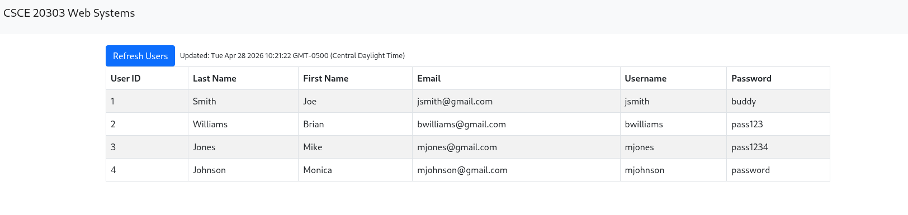

## CSCE 41333 Assignment One: Simple Single Page Application(SPA) using JavaScript,NodesJS/Express/MySQL2

This assignment will provide a simple full-stack SPA application that provides a Single HTML Page (*home.html*). This page should perform the following tasks:

1. Provide a listing of users for the basic WEB API implemented using NodeJS/Express/MySQL2.  The page should use an asynchronous network request(Fetch) to access the WEB API endpoint, HTTP://localhost:3000/users.  This API Endpoint will provide an a list of users formatted in an array of JSON Objects.  The contents of this array needs to be displayed on **home.html** by manipulating the DOM and inserting it into the page.

2. Provide a form (on Home.html or popup dialog) to add a new user to the database, using an Asynchonous network request with a **HTTP POST** to the Web API endpoint, HTTP://localhost:3000/users.  You will need to provide the API Route (endpoint) in your NodeJS/Express server, **app.js**

Your client-side JavaScript code will go in the **public/users.js** file.

Create Local MySQL database using *assign1.sql* script.
```
sudo mysql < assign1.sql
```

Example of the Page with the User Listing.

